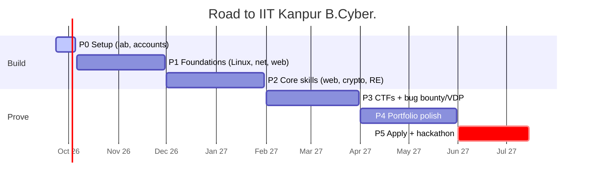

<div align="center">


<br/>

<a href="https://x.com/guptabittu998"></a>
<a href="https://hackerone.com/guptabittu998"></a>
<a href="https://bugcrowd.com/h/guptabittu998"></a>
<a href="https://tryhackme.com/p/YOUR_THM"></a>
<a href="https://play.picoctf.org/users/YOUR_PICO"></a>


</div>

---

### 🧪 `$ whoami`

```yaml
name:      Bittu Kumar
role:      Developer (7 yrs) → Security Researcher in training
focus:     [web security, api security, linux, cryptography, reverse engineering]
lab:       MacBook (Apple Silicon) + Kali Linux ARM on UTM
rules:     authorized targets only — in-scope, policy-first, responsible disclosure
mission:   B.Cyber. @ IIT Kanpur, 2027
motto:     "Ten billion percent." — Senku
```

---

### 🛠️ Toolkit

<p align="left">


</p>

---

### 🗺️ Roadmap to 2027



<details>
<summary><b>📈 Skill tree (click to expand)</b></summary>
<br/>

| Skill | Level |
|---|---|
| 🌐 Web Security | `███████░░░` 3/5 |
| 🐍 Python | `██████░░░░` 3/5 |
| 🐧 Linux | `████░░░░░░` 2/5 |
| 📡 Networking | `████░░░░░░` 2/5 |
| 🔑 Cryptography | `██░░░░░░░░` 1/5 |
| 🔍 Reverse Engineering | `██░░░░░░░░` 1/5 |

</details>

<details>
<summary><b>📓 Lab notebook — latest entries</b></summary>
<br/>

| Day | What I did | Link |
|---|---|---|
| 1 · 23 Sep 2026 | Kali lab on UTM, all accounts live, PortSwigger SQLi labs | [log](https://github.com/guptabittu998/bcyber-journey) |

</details>

<details>
<summary><b>🏆 Achievements (unlocking...)</b></summary>
<br/>

- [ ] 🧪 Lab online — Kali Linux ARM
- [ ] 🚩 First CTF on CTFtime
- [ ] 🎓 First verifiable certification
- [ ] 🐞 First valid responsible disclosure
- [ ] 🛠️ First open-source security tool

</details>

---

### 📊 Stats

<div align="center">


</div>

---

<div align="center">
<sub>🔐 I only test systems I'm authorized to test. Found something in my code? Open an issue.</sub>
</div>
